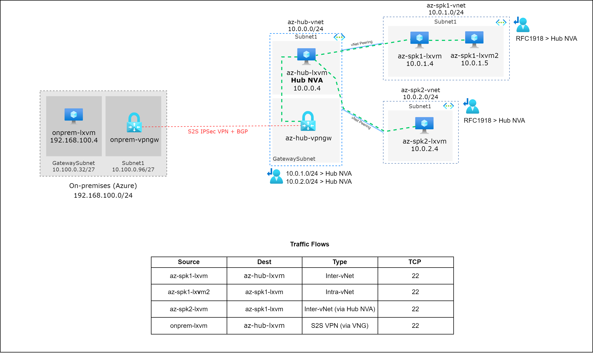
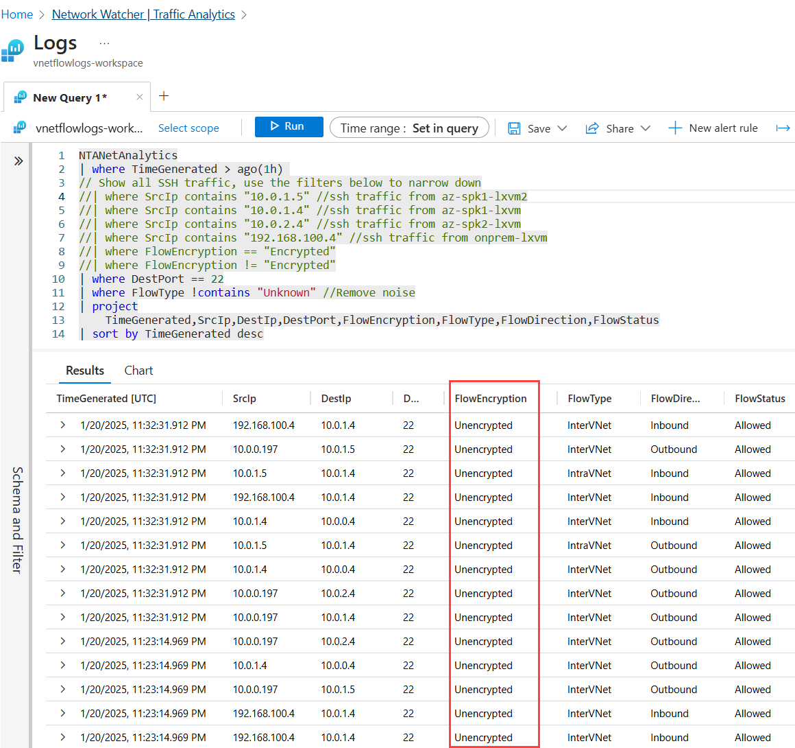
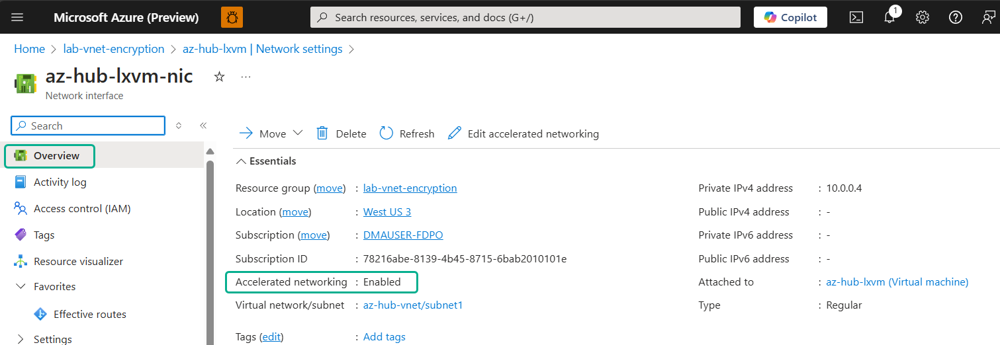
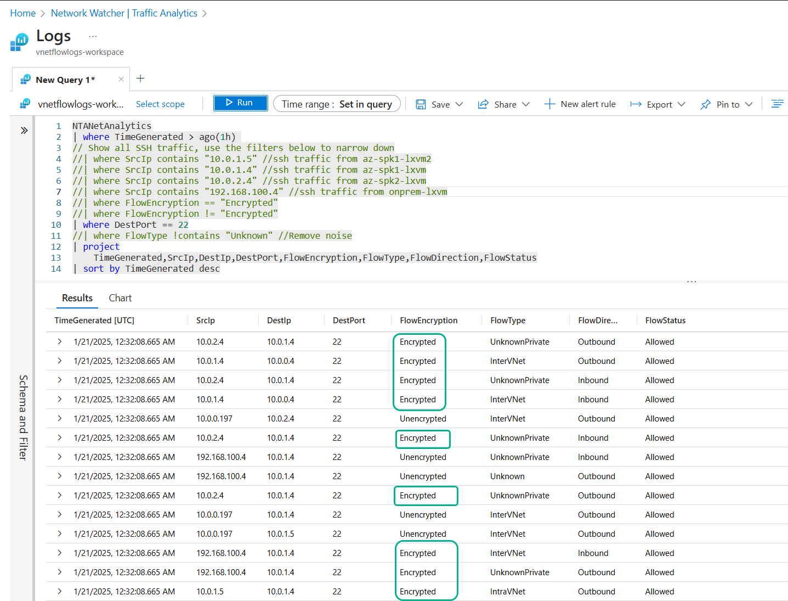

# Lab: Azure Virtual Network Encryption

## Intro

This a lab to demonstrate how to enable encryption for Azure Virtual Network and validate it using Traffic Analytics.
Below are the links to the official documentation to help you understand the concepts and the steps to enable encryption for Azure Virtual Network.

- [What is Azure Virtual Network encryption?](https://learn.microsoft.com/en-us/azure/virtual-network/virtual-network-encryption-overview)
- [Frequently asked questions for Azure Virtual Network encryption?](https://learn.microsoft.com/en-us/azure/virtual-network/virtual-network-encryption-faq)
- [Create a virtual network with encryption](https://learn.microsoft.com/en-us/azure/virtual-network/how-to-create-encryption)

## Important takeaways

- At the time this lab was created, there are compatibility limitations interacting with other Azure product such as Azure DNS and Private Link Service, please review the [limitations](https://learn.microsoft.com/en-us/azure/virtual-network/virtual-network-encryption-overview#limitations) section on the official documentation.
- Please review the official documentation to confirm which VM sizes support vNET encryption.
    - For this lab, we will use the Standard_D2d_v4 size to maintain minimal costs.
- Using the vNET encryption feature incurs no charges, apart from the costs associated with supported VM sizes. Enabling Accelerated Networking comes at no additional cost.
- Based on the official documentation: There are minimal performance overheads when using vNET encryption, but these are generally negligible. The feature is designed to be transparent and should not significantly impact the performance of your VMs.
    - The main reason is because the encryption processing is offloaded to an specilized hardaware called FPGA (Field-Programmable Gate Array). More information can be found in this paper [Azure Accelerated Networking: SmartNICs in the Public Cloud](https://www.microsoft.com/en-us/research/uploads/prod/2018/03/Azure_SmartNIC_NSDI_2018.pdf?msockid=14a99a3dc95567bc03778f53c8f4664c)
- Ensure that Accelerated Networking is enabled for all VMs.
- At this time, the only way to validate whether vNET encryption is operational is to utilize vNET Flow Logs. Integrating these logs with Traffic Analytics is crucial for effectively visualizing the data. That is demonstrated during the lab.

## Lab diagram



## Lab Scenario

This lab builds a Hub and Spoke in Azure and emulates vNET for the On-premises. Both are connected using S2S IPSec VPN using VPN Virtual Network Gateways.

Here are the steps to deploy the lab and make the appropriate configurations to enable vNET encryption and validations:

### Step 1 - Run the base lab deployment script

On this step, provide the username and password.

```bash
wget -q -O 1-deploy.sh https://raw.githubusercontent.com/dmauser/azure-vnet-encryption/refs/heads/main/1-deploy.sh
chmod +x 1-deploy.sh
./1-deploy.sh
```

### Step 2 - Validation before enabling vNET encryption

#### 2.1 - Run the following commands to generate traffic

Note: to access each VM use Serial Console or Bastion [instructions](#accessing-vms-using-bastion) below.

```bash
# On az-spk1-lxvm run the following command to generate traffic to az-hub-lxvm:
while true; do echo -n "$(date) "; netcat -v -z 10.0.0.4 22; sleep 15; done

# On az-spk1-lxvm2 run the following command to generate traffic to az-spk1-lxvm:
while true; do echo -n "$(date) "; netcat -v -z 10.0.1.4 22; sleep 15; done

# On az-spk2-lxvm run the following command to generate traffic to az-spk1-lxvm:
while true; do echo -n "$(date) "; netcat -v -z 10.0.1.4 22; sleep 15; done

# On onprem-lmxvm run the following command to generate traffic to az-spk1-lxvm:
while true; do echo -n "$(date) "; netcat -v -z 10.0.1.4 22; sleep 15; done
```

#### 2.2 - Review Traffic Analytics for encryption validation.

Access Log Analytics and select FlowFlog Type: VNet, click in "Launch Log Search Query". 


Run the following query:

```Kusto
NTANetAnalytics
| where TimeGenerated > ago(1h) 
// Show all SSH traffic, use the filters below to narrow down
//| where SrcIp contains "10.0.1.5" //ssh traffic from az-spk1-lxvm2
//| where SrcIp contains "10.0.1.4" //ssh traffic from az-spk1-lxvm
//| where SrcIp contains "10.0.2.4" //ssh traffic from az-spk2-lxvm
//| where SrcIp contains "192.168.100.4" //ssh traffic from onprem-lxvm
//| where FlowEncryption == "Encrypted"
//| where FlowEncryption != "Encrypted"
| where DestPort == 22
| where FlowType !contains "Unknown" //Remove noise
| project
    TimeGenerated,SrcIp,DestIp,DestPort,FlowEncryption,FlowType,FlowDirection,FlowStatus
| sort by TimeGenerated desc
```

Expected output:



### Step 3 - Enabling vNET encryption

Note that you can review the steps executed by the script by clicking on the link below.

```bash
curl -sL https://raw.githubusercontent.com/dmauser/azure-vnet-encryption/refs/heads/main/3-enable-vnetencryption.sh | bash
```

Here are the steps included in the script:
1) Enable Accelerated Networking for all VMs (except for the on-premises VM).
2) Enable vNET encryption in all Azure vNET (az-hub-vnet, az-spk1-vnet, az-spk2-vnet).
3) Stop, deallocate and start all VMs (except for the on-premises VM). This is required to active the vNET encryption feature the target VMs.


### Step 4 - Validation after enabling vNET encryption

#### 4.1 - Validate Accellerated Networking is enabled

On any of the Azure VMs, run the following command to validate Accelerated Networking is enabled:

```bash
sudo lspci
# Expected output with Accelerated Networking enabled:
fcbc:00:02.0 Ethernet controller: Mellanox Technologies MT27800 Family [ConnectX-5 Virtual Function] (rev 80)
# Only Azure VMs has Accelerated Networking enabled, on-premises VMs does not have this feature.
```
On Azure Portal you can also make the same validate the Azure VM NIC, as shown:



#### 4.2 - Run the following commands to generate traffic

Note: to access each VM use Serial Console or Bastion [instructions](#accessing-vms-using-bastion) below.

```bash
# On az-spk1-lxvm run the following command to generate traffic to az-hub-lxvm:
while true; do echo -n "$(date) "; netcat -v -z 10.0.0.4 22; sleep 15; done

# On az-spk1-lxvm2 run the following command to generate traffic to az-spk1-lxvm:
while true; do echo -n "$(date) "; netcat -v -z 10.0.1.4 22; sleep 15; done

# On az-spk2-lxvm run the following command to generate traffic to az-spk1-lxvm:
while true; do echo -n "$(date) "; netcat -v -z 10.0.1.4 22; sleep 15; done

# On onprem-lmxvm run the following command to generate traffic to az-spk1-lxvm:
while true; do echo -n "$(date) "; netcat -v -z 10.0.1.4 22; sleep 15; done
```

#### 4.2 - Review Traffic Analytics for encryption validation

```Kusto
NTANetAnalytics
| where TimeGenerated > ago(1h) 
// Show all SSH traffic, use the filters below to narrow down
//| where SrcIp contains "10.0.1.5" //ssh traffic from az-spk1-lxvm2
//| where SrcIp contains "10.0.1.4" //ssh traffic from az-spk1-lxvm
//| where SrcIp contains "10.0.2.4" //ssh traffic from az-spk2-lxvm
//| where SrcIp contains "192.168.100.4" //ssh traffic from onprem-lxvm
//| where FlowEncryption == "Encrypted"
//| where FlowEncryption != "Encrypted"
| where DestPort == 22
| where FlowType !contains "Unknown" //Remove noise
| project
    TimeGenerated,SrcIp,DestIp,DestPort,FlowEncryption,FlowType,FlowDirection,FlowStatus
| sort by TimeGenerated desc
```

Expected output:


## Accessing VMs using Bastion

To access the VMs, you can use the Azure Bastion service. The script below will provide you with the necessary information to access the VMs.

```bash	
###### BASTION SSH ######
# Open a new terminal for each VM
# Note: change the rg variable to the resource group name you used in the deployment
# az-hub-lxvm
rg=lab-vnet-encryption
username=azureuser
az network bastion ssh --name az-hub-bastion --resource-group $rg \
--target-resource-id $(az vm show -g $rg -n az-hub-lxvm --query id -o tsv) \
--auth-type password \
--username $username

# az-spk1-lxvm
rg=lab-vnet-encryption
username=azureuser
az network bastion ssh --name az-hub-bastion --resource-group $rg \
--target-resource-id $(az vm show -g $rg -n az-spk1-lxvm --query id -o tsv) \
--auth-type password \
--username $username

# az-spk1-lxvm2
rg=lab-vnet-encryption
username=azureuser
az network bastion ssh --name az-hub-bastion --resource-group $rg \
--target-resource-id $(az vm show -g $rg -n az-spk1-lxvm2 --query id -o tsv) \
--auth-type password \
--username $username

# az-spk2-lxvm
rg=lab-vnet-encryption
username=azureuser
az network bastion ssh --name az-hub-bastion --resource-group $rg \
--target-resource-id $(az vm show -g $rg -n az-spk2-lxvm --query id -o tsv) \
--auth-type password \
--username $username

# onprem-lxvm
rg=lab-vnet-encryption
username=azureuser
az network bastion ssh --name onprem-bastion --resource-group $rg \
--target-resource-id $(az vm show -g $rg -n onprem-lxvm --query id -o tsv) \
--auth-type password \
--username $username
```

## Lab Cleanup
To remove all resources created by this lab, run the following command:

```bash
# Note: change the rg variable to the resource group name you used in the deployment
rg=lab-vnet-encryption
az group delete -n $rg -y
```

### Conclusion

On this lab you learned how to enable encryption for Azure Virtual Network and validate it using Traffic Analytics.
